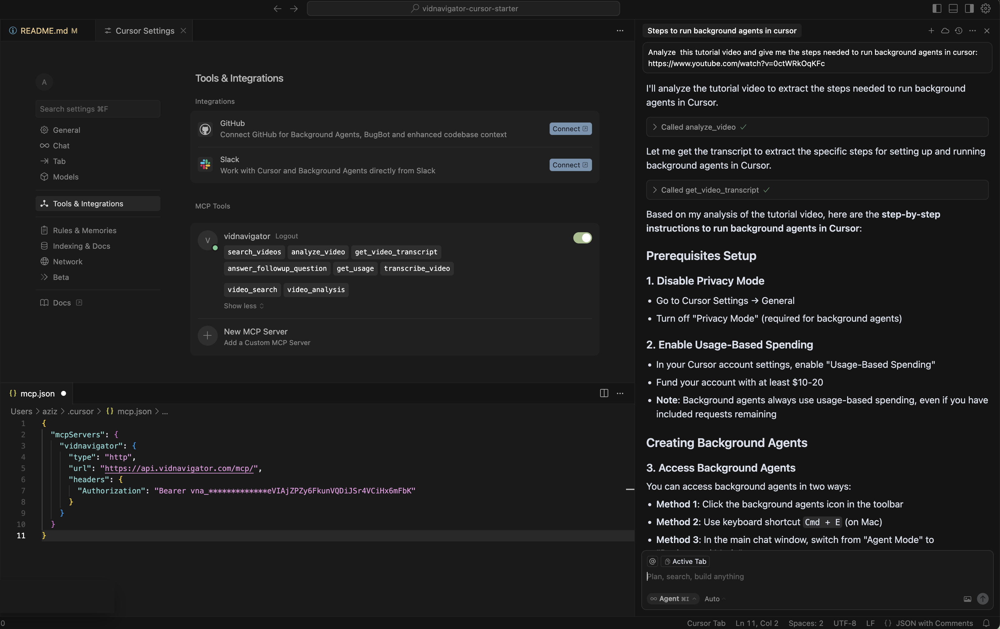

# 🎥 VidNavigator MCP Server

AI-powered video search, analysis, and transcription through the Model Context Protocol (MCP). Available for both **Cursor** and **Claude Desktop**.



## 🚀 Features

- 🔍 **AI Video Search**: Search for videos using natural language with advanced AI analysis and relevance ranking
- 📽️ **Video Analysis**: Comprehensive analysis of YouTube videos with summaries, key insights, and Q&A
- 📝 **Transcript Extraction**: Get YouTube video transcripts without analysis (fast and lightweight)
- 🎬 **Multi-Platform Transcription**: Transcribe videos from Instagram, TikTok, Facebook, and other social platforms
- 💬 **Follow-up Questions**: Ask specific questions about previously analyzed videos
- 📊 **Usage Tracking**: Monitor your API usage and subscription limits

## 📋 Quick Start

### For Cursor Users

**⚡ Quick Setup (2 minutes)**

1. 🗝 [Get your free API key](https://vidnavigator.com) → User → Dev-tools
2. Open Cursor → Settings → Tools and integration → Add MCP server, then paste:

```jsonc
{
  "mcpServers": {
    "vidnavigator": {
      "type": "http",
      "url": "https://api.vidnavigator.com/mcp/",
      "headers": {
        "Authorization": "Bearer YOUR_API_KEY_HERE"
      }
    }
  }
}
```

*Replace with your actual API key*

3. 🎤 Start chatting!
4. (Optional) Use the [preconfigured agent](./cursor/vidnavigator.agent) for an enhanced experience

**📁 [→ Complete Cursor Setup Guide](./cursor/)**

### For Claude Desktop Users

**⚡ One-Click Installation**

1. 📥 **[Download Latest Extension (.dxt)](https://github.com/vidnavigator/vidnavigator-mcp-starter/releases/latest)**
2. 🗝 [Get your free API key](https://vidnavigator.com) → User → Dev-tools
3. Open Claude Desktop → Settings → Extensions → Install from file
4. Select the downloaded `.dxt` file
5. Configure your API key in the extension settings
6. 🎤 Start chatting!

**📁 [→ Complete Claude Desktop Setup Guide](./claude-desktop/)**

## 💬 Example Queries

- *"Find a video where Neil deGrasse Tyson explains gravity"*
- *"Summarize this YouTube video: https://youtube.com/watch?v=xyz"*
- *"What did the speaker say about climate policy?"*
- *"Give me the transcript for this TikTok: [link]"*
- *"How many calls to vidnavigator have I made this month?"*

## 🛠 Development & Deployment

### For Maintainers

**Building Claude Desktop Extension:**
```bash
cd claude-desktop
npm install
npm run build
```

This generates `claude-desktop/dist/vidnavigator.dxt` ready for distribution.

**Creating Releases:**
- The `.dxt` file should be uploaded to GitHub Releases
- Users can download and install directly in Claude Desktop

### Project Structure

```
vidnavigator-mcp-starter/
├── 📁 cursor/              # Cursor-specific files
│   ├── vidnavigator.agent  # Preconfigured agent
│   ├── settings.json.example
│   └── README.md          # Cursor setup guide
│
├── 📁 claude-desktop/      # Claude Desktop extension
│   ├── server/            # MCP server implementation
│   ├── manifest.json      # Extension manifest
│   ├── build.js          # Build script for .dxt
│   ├── package.json      # Dependencies
│   └── README.md         # Claude Desktop setup guide
│
├── 📁 releases/           # Built .dxt files
├── 📁 docs/              # Additional documentation
└── Screenshot.png        # Demo screenshot
```

## 🔧 Available Tools

- **search_videos**: Search for videos with AI analysis and ranking
- **analyze_video**: Analyze video content and generate summaries
- **get_video_transcript**: Extract video transcripts
- **answer_followup_question**: Ask questions about analyzed videos
- **get_usage**: Check API usage and subscription limits
- **transcribe_video**: Transcribe non-YouTube videos

## 📊 API Usage

All tools are subject to your [VidNavigator](https://vidnavigator.com) subscription plan:
- **Free Plan**: Limited requests per month
- **Paid Plans**: Higher limits based on plan tier

Use the "get_usage" tool to check your current usage and remaining limits.

## 🆘 Support

- **Website**: [https://vidnavigator.com](https://vidnavigator.com)
- **Documentation**: [https://docs.vidnavigator.com](https://docs.vidnavigator.com)
- **Issues**: [GitHub Issues](https://github.com/vidnavigator/vidnavigator-mcp-starter/issues)
- **Email**: support@vidnavigator.com

## 📄 License

MIT License - see [LICENSE](./LICENSE) file for details.

---

Made with ❤️ by the [VidNavigator](https://vidnavigator.com) team